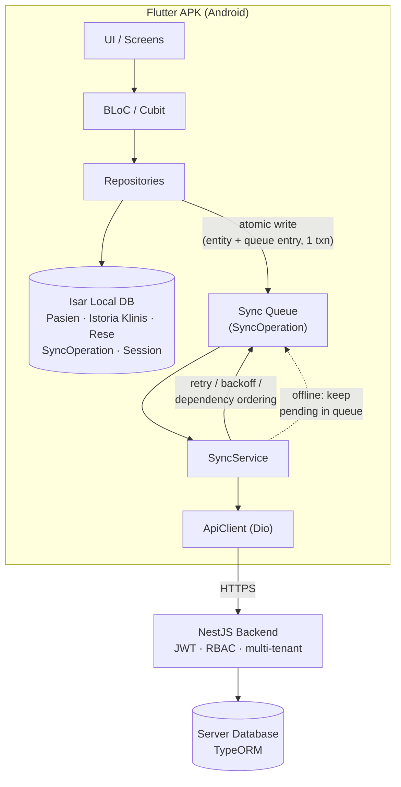
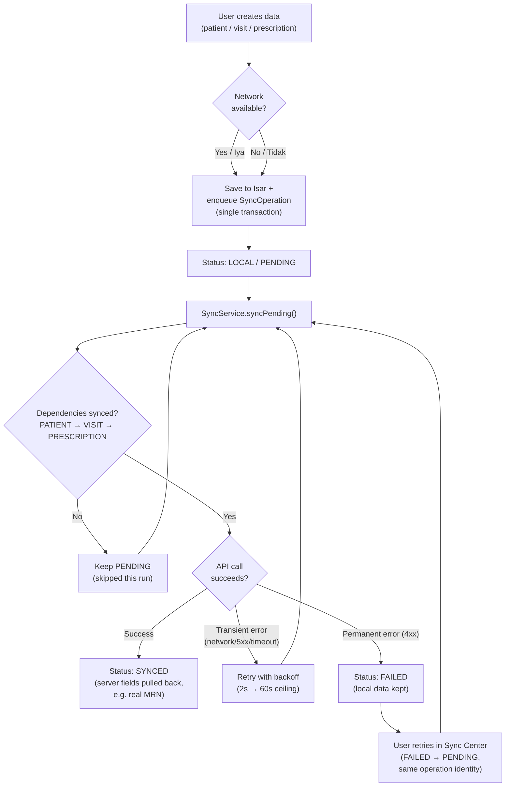
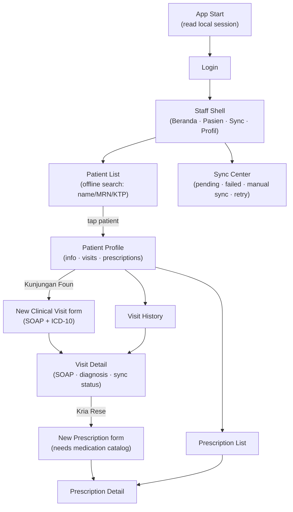

# IstoriaMed-TL

**English** | [Bahasa Indonesia](#bahasa-indonesia)

IstoriaMed-TL is an open-source Electronic Medical Record (EMR/RME) system that
helps patients and healthcare staff in Timor-Leste manage clinical consultations.
It is designed **APK-first** and **local-first**: the Android app keeps working
fully offline, queues every change locally, and syncs with the server when a
connection is available.

> Projetu open source atu halo RME (Record medical electronic) hodi ajuda
> pasiente sira iha Timor-Leste hodi halo konsulta.

## Overview / Sistema

- **Backend** (`src/backend`): NestJS + TypeORM REST API with JWT
  authentication, multi-tenant (tenant / facility) data ownership, and
  role-based access control.
- **Frontend** (`src/frontend`): Flutter Android app (APK) built on a
  local-first architecture — Isar local database, flutter_bloc state
  management, Dio API client, and a persistent offline sync queue.

### Domain model

```
Patient (Pasien)
   ↓
Clinical Visit (Istoria Klinis)
   ↓
Prescription (Rese) → Prescription Items
```

### Roles

| Role | Platform |
|---|---|
| Doctor, Nurse, Midwife, Pharmacy (staff) | Android APK |
| Patient | Android APK (shell prepared, backend role not yet issued) |
| Super Admin, Ministry | Web (planned, not built) |

## Architecture / Arkitektura

The app follows a strict one-way data flow. The UI never talks to the network
directly for core workflows:

```
UI
 ↓
BLoC / Cubit
 ↓
Repository
 ↓
Isar (local DB)  ──►  Sync Queue (SyncOperation)
                          ↓
                      SyncService  →  ApiClient  →  Backend
```

Key properties:

- **Atomic local writes** — the entity and its `SyncOperation` queue entry are
  always written inside a single Isar transaction; no orphan data, no silently
  dropped sync work.
- **Device-reserved IDs** — UUIDs are reserved on the device so the server can
  adopt them verbatim; no ID mapping is ever needed and replays are idempotent.
- **Dependency ordering** — queue operations respect
  `PATIENT → CLINICAL_VISIT → PRESCRIPTION`; a prescription is never sent
  before its visit, or a visit before its patient.
- **Honest sync state** — the UI shows real queue state
  (Pending / Synced / Failed); there is no fake Online/Offline indicator.
- **Retry with backoff** — transient failures are retried with exponential
  backoff; permanent failures land in a FAILED queue the user can retry
  manually, keeping the same operation identity.

## Getting Started / Cara Menjalankan

### Backend

```bash
cd src/backend
npm install
npm run start:dev
```

### Frontend (Flutter APK)

```bash
cd src/frontend
flutter pub get
flutter run            # on a connected device/emulator
```

### Tests / Pengujian

```bash
cd src/backend && npm test
cd src/frontend && flutter analyze && flutter test
```

> Note: Isar-based repository tests use plain `async` tests (not
> `testWidgets`) because Isar queries do not complete inside Flutter's
> fake-async test environment. Keep this pattern for new local-DB tests.

## Project Status / Status

Development is phased and tracked in [`progres.md`](progres.md) (gitignored).
Completed so far: backend foundation (auth, users, facilities, patient and
clinical visit domains, database integrity), and the Flutter APK through
Phase 9 (patient workflow, offline sync center, prescription flow, navigation
hardening, role-aware shell foundation).

Known limitations are recorded honestly in `progres.md` and
[`docs/`](docs/); notable ones: no offline medication catalog yet, no
UPDATE/DELETE sync, no token re-auth flow yet, and the demo mode
(`kDemoMode`) must be disabled before any real deployment.

## System Flowcharts / Bagan Alur Sistem

### 1. Overall system architecture / Arsitektur sistem keseluruhan



### 2. Offline write & sync lifecycle / Siklus tulis offline & sinkronisasi



### 3. Staff clinical workflow / Alur kerja klinis staf



## Documentation / Dokumentasi

See the [`docs/`](docs/) folder, including:

- `flutter-navigation.md` — shells and screen flow
- `flutter-offline-sync-flow.md` — sync engine and queue design
- `flutter-patient-flow.md`, `flutter-clinical-visit-flow.md`,
  `flutter-prescription-flow.md` — clinical workflows
- `authentication-authorization.md`, `database-architecture.md` — backend
- `prd.md` — product requirements

---

<a id="bahasa-indonesia"></a>
# IstoriaMed-TL (Bahasa Indonesia)

IstoriaMed-TL adalah sistem Rekam Medis Elektronik (RME) open source yang
membantu pasien dan tenaga kesehatan di Timor-Leste mengelola konsultasi
klinis. Sistem ini dirancang **APK-first** dan **local-first**: aplikasi
Android tetap berfungsi penuh saat offline, menyimpan setiap perubahan di
antrean lokal, lalu menyinkronkannya dengan server ketika koneksi tersedia.

## Gambaran Sistem

- **Backend** (`src/backend`): REST API NestJS + TypeORM dengan autentikasi
  JWT, kepemilikan data multi-tenant (tenant / fasilitas), dan kontrol akses
  berbasis role (RBAC).
- **Frontend** (`src/frontend`): aplikasi Flutter Android (APK) dengan
  arsitektur local-first — database lokal Isar, state management flutter_bloc,
  API client Dio, dan antrean sinkronisasi offline yang persisten.

### Model domain

```
Pasien (Patient)
   ↓
Kunjungan Klinis (Clinical Visit)
   ↓
Resep (Prescription) → Item Resep
```

### Role / Peran

| Role | Platform |
|---|---|
| Dokter, Perawat, Bidan, Farmasi (staf) | Android APK |
| Pasien | Android APK (shell sudah disiapkan, role backend belum diterbitkan) |
| Super Admin, Kementerian | Web (direncanakan, belum dibangun) |

## Arsitektur

Aplikasi mengikuti alur data satu arah. UI tidak pernah memanggil jaringan
langsung untuk workflow inti:

```
UI
 ↓
BLoC / Cubit
 ↓
Repository
 ↓
Isar (DB lokal)  ──►  Sync Queue (SyncOperation)
                          ↓
                      SyncService  →  ApiClient  →  Backend
```

Sifat-sifat utama:

- **Penulisan lokal atomik** — entity dan entri `SyncOperation` selalu ditulis
  dalam satu transaksi Isar; tidak ada data yatim, tidak ada pekerjaan sync
  yang hilang diam-diam.
- **ID dicadangkan perangkat** — UUID dicadangkan di perangkat sehingga server
  mengadopsinya apa adanya; tidak perlu pemetaan ID dan replay bersifat
  idempoten.
- **Urutan dependensi** — operasi antrean menghormati
  `PATIENT → CLINICAL_VISIT → PRESCRIPTION`; resep tidak pernah dikirim
  sebelum kunjungannya, kunjungan tidak sebelum pasiennya.
- **Status sync yang jujur** — UI menampilkan kondisi antrean yang nyata
  (Pending / Synced / Failed); tidak ada indikator Online/Offline palsu.
- **Retry dengan backoff** — kegagalan sementar diulang dengan exponential
  backoff; kegagalan permanen masuk antrean FAILED yang bisa di-retry manual
  oleh pengguna dengan identitas operasi yang sama.

## Cara Menjalankan

### Backend

```bash
cd src/backend
npm install
npm run start:dev
```

### Frontend (Flutter APK)

```bash
cd src/frontend
flutter pub get
flutter run            # pada device/emulator yang tersambung
```

### Pengujian

```bash
cd src/backend && npm test
cd src/frontend && flutter analyze && flutter test
```

> Catatan: test repository berbasis Isar memakai test `async` biasa (bukan
> `testWidgets`) karena query Isar tidak selesai di dalam lingkungan
> fake-async Flutter. Pertahankan pola ini untuk test database lokal baru.

## Status Proyek

Pengembangan dilakukan per fase dan dilacak di [`progres.md`](progres.md)
(gitignored). Yang sudah selesai: fondasi backend (auth, users, fasilitas,
domain pasien dan kunjungan klinis, integritas database), serta Flutter APK
sampai Phase 9 (workflow pasien, Sync Center offline, flow resep, penguatan
navigasi, fondasi shell role-aware).

Keterbatasan yang diketahui dicatat secara jujur di `progres.md` dan
[`docs/`](docs/); yang utama: belum ada katalog obat offline, belum ada sync
UPDATE/DELETE, belum ada flow re-auth token, dan mode demo (`kDemoMode`)
harus dimatikan sebelum deployment nyata.

## Dokumentasi

Lihat folder [`docs/`](docs/), antara lain:

- `flutter-navigation.md` — shell dan alur layar
- `flutter-offline-sync-flow.md` — desain sync engine dan antrean
- `flutter-patient-flow.md`, `flutter-clinical-visit-flow.md`,
  `flutter-prescription-flow.md` — workflow klinis
- `authentication-authorization.md`, `database-architecture.md` — backend
- `prd.md` — kebutuhan produk
