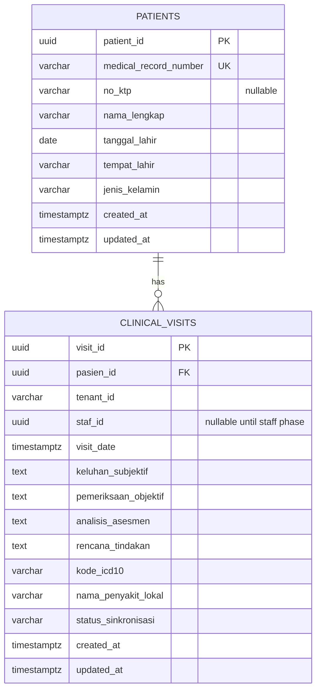

# Database Architecture

## Database

PostgreSQL. The schema is compatible with Supabase-hosted PostgreSQL, but the backend remains the authority for business logic and data access.

## Provider

Supabase-compatible PostgreSQL. Local verification uses a disposable PostgreSQL 16 Alpine container.

## ORM

TypeORM is the single backend ORM. No Prisma, Drizzle, or second persistence strategy was added.

## Migration Strategy

Migrations are versioned TypeORM migration classes under `src/backend/src/database/migrations`. They are compiled and run with `npm run migration:run`. Applied migrations are never edited; the MRN width correction was added as a second migration.

## Connection Strategy

`DATABASE_URL` is required by the backend database configuration. `DATABASE_SSL=true` enables TLS with certificate verification disabled for managed PostgreSQL compatibility; production deployment must provide the platform's approved TLS configuration. TypeORM owns one pooled connection manager for the NestJS application. Schema synchronization is disabled.

## Repository Strategy

Controllers call application services. Services use TypeORM repositories and map persistence records to the existing API entities. This keeps domain/API contracts separate from database decorators.

## Schema

### Patient

Patient IDs are UUIDs generated by the backend and are immutable. MRNs are generated at create time as `MRN-<UUID>`, stored as unique values, and do not change on reads. `no_ktp` is nullable; a partial unique index rejects duplicate non-null KTP values while allowing multiple unknown patients.

### Clinical Visit

Clinical visits reference patients through a real foreign key with `ON DELETE RESTRICT`. `staf_id` is nullable because authentication/staff tables do not exist yet. The current tenant value is stored for future authorization work but is not yet a security boundary.

## Testing

Unit tests use repository doubles for service behavior. Integration tests run the real NestJS API, TypeORM, migrations, and PostgreSQL 16. The database test is isolated in a disposable Podman container and is never used as a development or production database.

## Production Considerations

Use a managed PostgreSQL/Supabase connection string through secret management, run migrations as a controlled deployment step, keep `synchronize=false`, and provision backups/retention before handling real medical data. Authentication, RBAC, facility authorization, audit logging, and tenant enforcement remain required before production use.

## Known Limitations

The application currently has no authentication, staff relationship, facility authorization, soft-delete policy, or cross-facility access policy. Those are intentionally deferred and are not implied by the current database schema.
